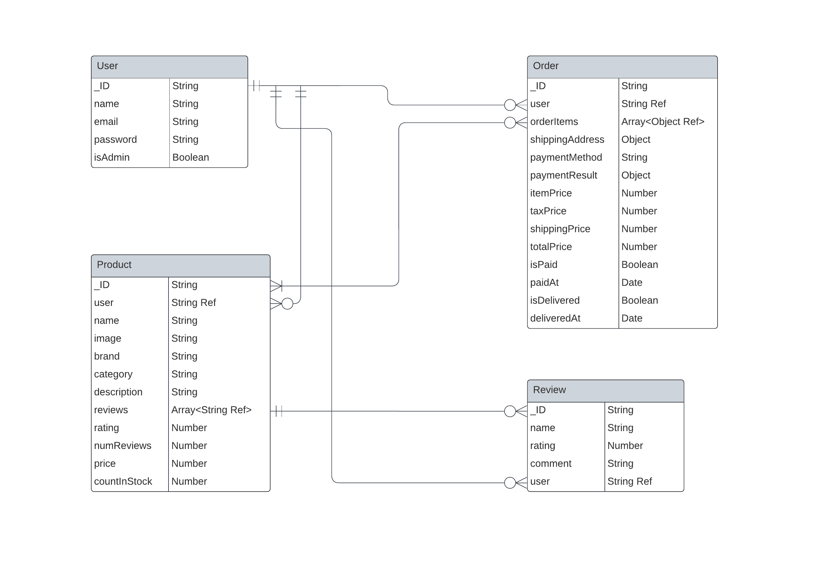

# Proton Store eCommerce Platform

This project contains an eCommerce platform built with the MERN stack & Redux. It has a full-featured shopping cart built using the PayPal API & credit/debit payments.

- [Features](#features)
- [Usage](#usage)
  - [Env Variables](#env-variables)
  - [Install Dependencies (frontend & backend)](#install-dependencies-frontend--backend)
  - [Run](#run)
- [Build & Deploy](#build--deploy)
  - [Seed Database](#seed-database)

## Features

- Full featured shopping cart
- Product reviews and ratings
- Top products carousel
- Product pagination
- Product search feature
- User profile with orders
- Admin product management
- Admin user management
- Admin Order details page
- Mark orders as delivered option
- Checkout process (shipping, payment method, etc)
- PayPal / credit card integration
- Database seeder (products & users)

## Usage

- Create a MongoDB database and obtain your `MongoDB URI` - [MongoDB Atlas](https://www.mongodb.com/cloud/atlas/register)
- Create a PayPal account and obtain your `Client ID` - [PayPal Developer](https://developer.paypal.com/)

### Env Variables

Rename the `.env.example` file to `.env` and add the following

```
PORT=8000
NODE_ENV=development
MONGO_URI=your_value_goes_here
JWT_SECRET=your_value_goes_here
PAGINATION_LIMIT=8

PAYPAL_CLIENT_ID=your_value_goes_here
PAYPAL_APP_SECRET=your_value_goes_here
PAYPAL_API_URL=https://api-m.sandbox.paypal.com
```

You can change the PAGINATION_LIMIT to what you prefer

### Install Dependencies (frontend & backend)

Ensure that [nvm](https://github.com/nvm-sh/nvm), [npm](https://www.npmjs.com/) and Nodemon are installed globally

Install the correct version of Node running this command in the project root folder

```
nvm install
```

```
npm install
cd client
npm install
```

### Run

```
# Run frontend (:3000) & backend (:8000)
npm run dev

# Run backend only
npm run server
```

## Build & Deploy

```
# Create frontend prod build
cd client
npm run build
```

### Seed Database

You can use the following commands to seed the database with some sample users and products as well as destroy all the data

```
# Import data
npm run data:import

# Destroy data
npm run data:destroy
```

```
Sample User Logins

admin@email.com (Admin)
123456

john@email.com (Customer)
123456

jane@email.com (Customer)
123456
```

### Entity Relationship Diagram (ERD)


